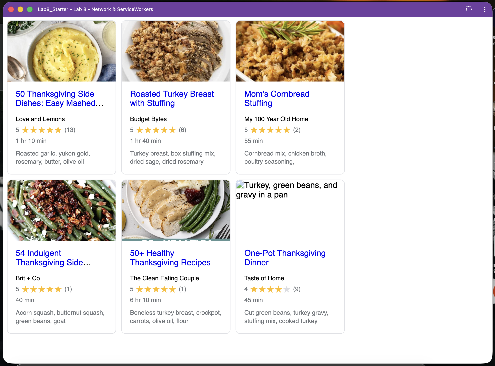

# Lab8-Starter

## Name

- Nhan Doan

## Deployed GitHub Pages URL

https://nhdoan0412.github.io/Lab8_Starter/

## Graceful Degradation and Service Workers

Graceful degradation and service workers are connected because service workers help the app still work when things are not perfect, like when the internet is slow or completely offline. In this lab, the recipe page normally gets the HTML, CSS, JavaScript, images, and recipe data from the network. But after the service worker caches those files, the browser can reuse the saved versions instead of needing to download everything again. So even if the network stops working, the app does not fully break and can still show the cached recipe cards and page layout.

## PWA Screenshot

